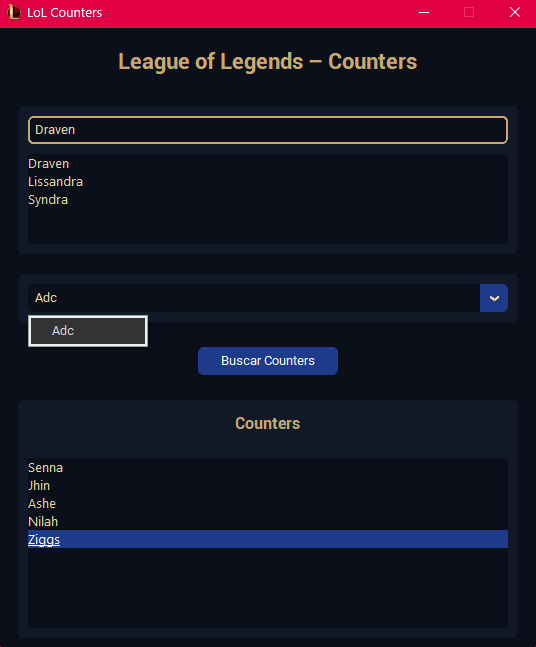

# 🛡️ LoL Counters

Aplicação desktop em **Python** para consultar **counters de campeões do League of Legends**, com interface moderna, autocomplete, filtro por lane e suporte a executável `.exe`.

---

## 🎮 Sobre o Projeto

O **LoL Counters** foi criado para ajudar jogadores a tomarem decisões melhores durante a seleção de campeões.

Com ele você pode:
- Buscar campeões por **nome parcial**
- Filtrar os counters por **rota**
- Visualizar resultados de forma clara e rápida
- Utilizar uma interface com **tema dourado inspirado no LoL**
- Executar como aplicativo Windows (`.exe`)

---

## ✨ Funcionalidades

✔ Busca inteligente (autocomplete)  
✔ Filtro por **Top / Jungle / Mid / ADC / Support**  
✔ Interface gráfica moderna com **customTkinter**  
✔ Tooltips com dicas de lane

---

## 🖼️ Interface

> Interface com tema dourado inspirado no League of Legends, focada em clareza e usabilidade.

---

## 📦 Baixe e Use!
- Abra o aplicativo
- Digite o nome (ou parte) de um campeão
- Selecione o campeão na lista
- Escolha a lane desejada
- Visualize os counters recomendados

---

## 🤝 Contribuições

Contribuições são bem-vindas!
- Faça um fork
- Crie uma branch (`feature/minha-feature`)
- Commit suas alterações
- Abra um Pull Request

---

> ⭐ Se este projeto te ajudou, considere deixar uma estrela no repositório!